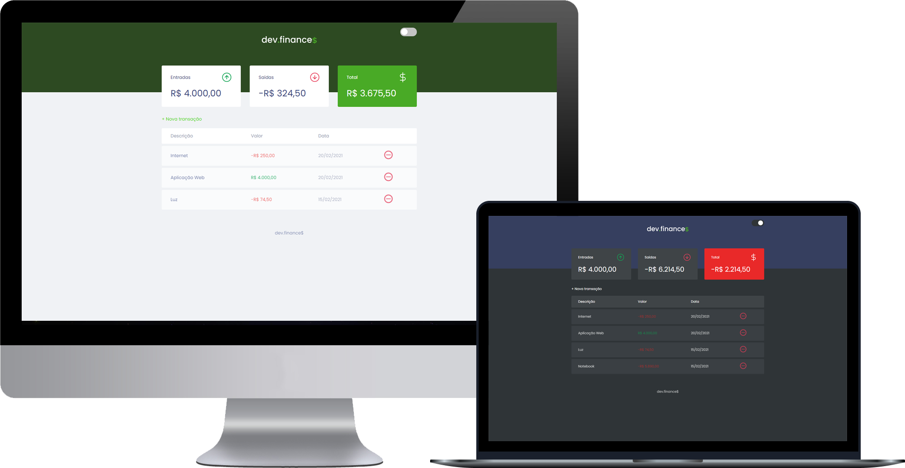

<h1 align="center">
  
</h1>
 
 

  

 

## Sobre o projeto 💬
O **dev.finance$** é uma aplicação web de controle financeiro desenvolvida na ***Maratona Discover***, da ***Rocketseat***, no qual você pode registrar e excluir transações, e visualizar seu saldo total de acordo com as entradas e saídas.

## Tecnologias 🚀
Desenvolvido utilizando as seguintes tecnologias:
* HTML5
* CSS3
* JavaScript

## Funcionalidades extras 📌
* Darkmode;
* Quando o saldo total for negativo, o card fica vermelho.
---
Feito por: [Vinícius Figueiroa](https://github.com/vinixiii) 🙋🏻‍♂️
